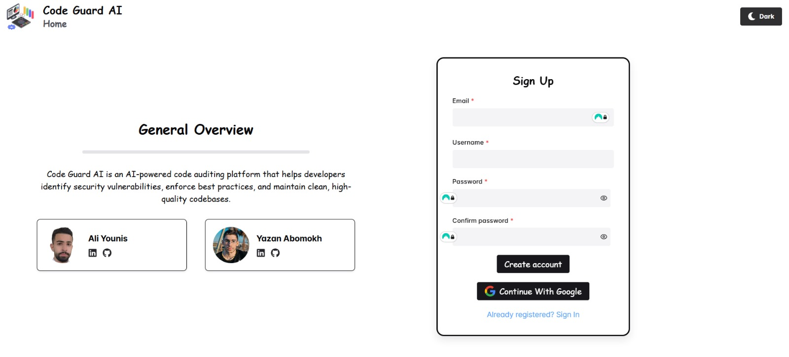
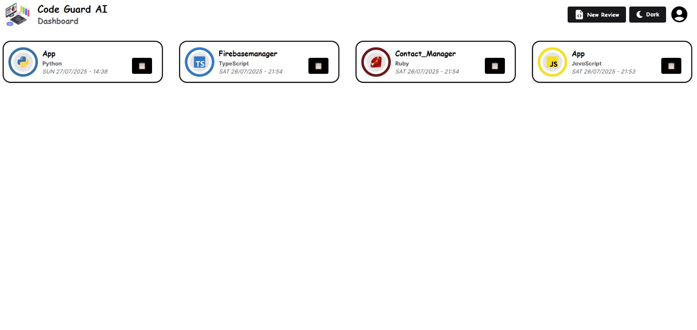
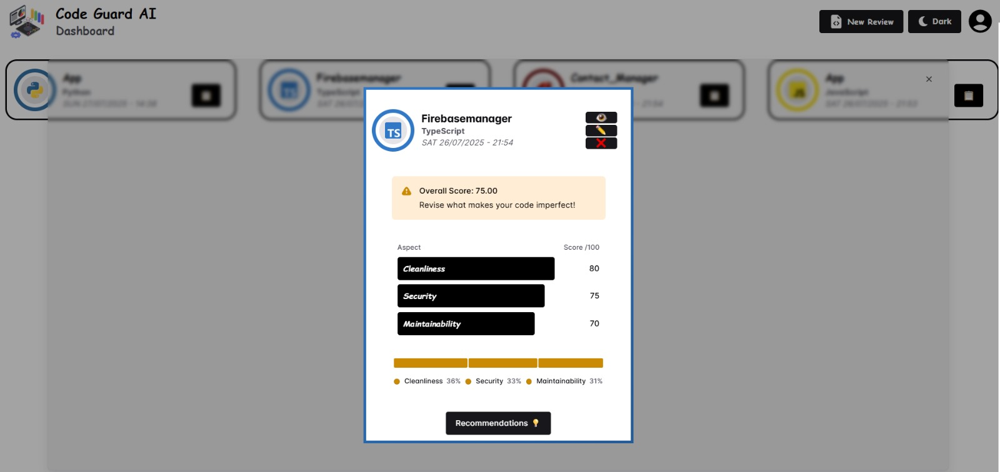
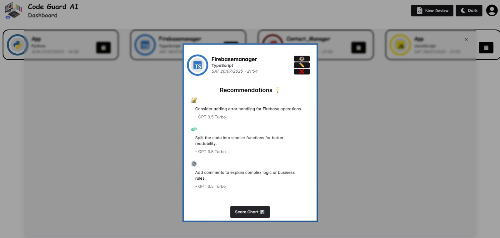
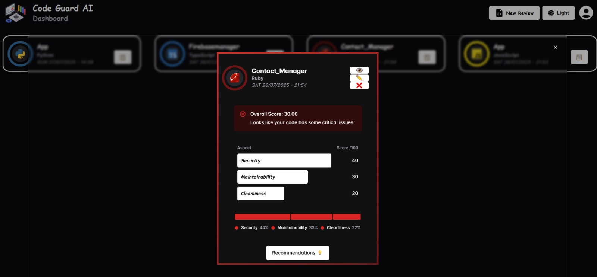
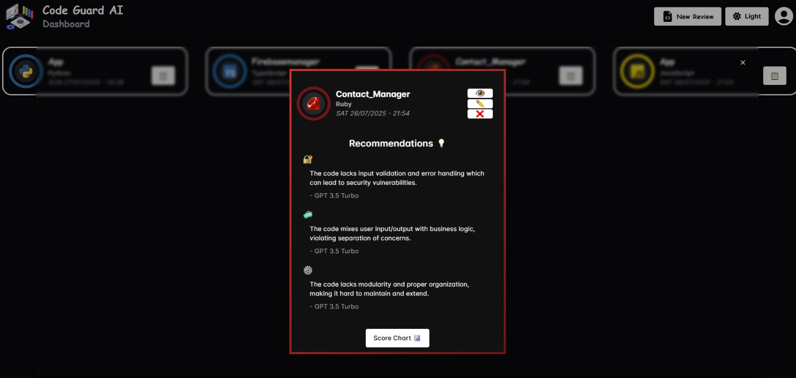

# Code Guard AI 🔒

<div align="center">
  

  **AI-Powered Code Analysis and Security Platform**

  
</div>

## 📋 Overview

**Code Guard AI** is an intelligent code auditing platform that leverages artificial intelligence to analyze source code for security vulnerabilities, code quality, and maintainability issues. Built with modern web technologies, it provides developers with comprehensive code reviews, actionable recommendations, and beautiful visualizations to improve their codebase quality.

## ✨ Key Features

### 🎯 **AI-Powered Code Analysis**
- **Multi-Language Support**: Analyzes code in Python, JavaScript, TypeScript, Java, C#, C++, C, Kotlin, Ruby, and more
- **Comprehensive Scoring**: Evaluates code across three key dimensions:
  - 🔒 **Security** (0-100): Identifies potential security vulnerabilities
  - 🧹 **Cleanliness** (0-100): Assesses code style and organization
  - 🔧 **Maintainability** (0-100): Evaluates code maintainability and structure

### 📊 **Interactive Visualizations**


- **Dynamic Charts**: Beautiful bar charts and score visualizations using Chakra UI
- **Real-time Updates**: Live score updates with color-coded indicators
- **Responsive Design**: Optimized for all screen sizes

### 💡 **Smart Recommendations**


- **AI-Generated Suggestions**: Personalized recommendations from GPT-4 and GPT-3.5-turbo
- **Categorized Feedback**: Organized by Security, Cleanliness, and Maintainability
- **Actionable Insights**: Specific, implementable suggestions with citations

### 🌙 **Dark Mode Support**



- **Seamless Theme Switching**: Toggle between light and dark modes
- **Consistent Experience**: Beautiful UI in both themes
- **User Preference Memory**: Remembers theme selection

### 🎨 **Modern User Interface**
- **Flippable Cards**: Interactive 3D card animations for code reviews
- **Syntax Highlighting**: Beautiful code display with language-specific highlighting
- **Drag & Drop Upload**: Intuitive file upload with support for multiple programming languages
- **Responsive Layout**: Mobile-first design with Chakra UI components

## 🏗️ Architecture

### Frontend (React + TypeScript)
- **Framework**: React 19 with TypeScript
- **UI Library**: Chakra UI v3 for modern, accessible components
- **State Management**: React Hooks and Context API
- **Routing**: React Router DOM v7
- **Animations**: Framer Motion for smooth transitions
- **Forms**: React Hook Form with Zod validation
- **Charts**: Recharts and Chakra UI Charts for data visualization

### Backend (Python + Flask)
- **Framework**: Flask with CORS support
- **Authentication**: Firebase Admin SDK with JWT tokens
- **Database**: Google Cloud Firestore
- **AI Integration**: OpenAI GPT-4 and GPT-3.5-turbo APIs
- **Security**: JWT-based authentication with decorators

### Authentication & Database
- **Authentication**: Firebase Authentication (Email/Password + Google OAuth)
- **Database**: Google Cloud Firestore for user data and code reviews
- **Security**: Token-based API authentication

## 🛠️ Technology Stack

### Frontend Dependencies
```json
{
  "@chakra-ui/react": "^3.21.0",
  "@chakra-ui/charts": "^3.21.0",
  "react": "^19.1.0",
  "typescript": "~5.8.3",
  "framer-motion": "^12.19.1",
  "react-router-dom": "^7.6.3",
  "react-hook-form": "^7.58.1",
  "zod": "^3.25.67",
  "firebase": "^11.9.1"
}
```

### Backend Dependencies
```python
Flask==3.1.1
firebase-admin==6.9.0
openai==1.92.3
flask-cors==6.0.1
google-cloud-firestore==2.21.0
```

### Development Tools
- **Build Tool**: Vite with TypeScript support
- **Linting**: ESLint with React hooks plugin
- **Code Formatting**: Prettier integration
- **Package Manager**: npm

## 🚀 Getting Started

### Prerequisites
- Node.js (v18 or higher)
- Python (v3.8 or higher)
- Firebase project with Authentication and Firestore enabled
- OpenAI API key

### Installation

1. **Clone the repository**
   ```bash
   git clone <repository-url>
   cd Code-Guard-AI
   ```

2. **Frontend Setup**
   ```bash
   cd code_guard_ai
   npm install
   npm run dev
   ```

3. **Backend Setup**
   ```bash
   cd Server
   pip install -r requirements.txt
   python app.py
   ```

4. **Environment Configuration**
   - Configure Firebase credentials in `FirebaseConfig.ts`
   - Add OpenAI API key to `Server/openai_key.json`
   - Set up Firebase service account key

## 📱 Usage

1. **Registration/Login**: Create an account or sign in with Google
2. **Upload Code**: Drag and drop your source code files
3. **AI Analysis**: Wait for the AI to analyze your code
4. **Review Results**: View scores and recommendations in interactive cards
5. **Take Action**: Implement suggested improvements

## 🎯 Core Components

### Authentication System
- Email/Password authentication
- Google OAuth integration
- JWT token management
- Secure API endpoints

### Code Analysis Engine
- Multi-language file parsing
- OpenAI GPT integration
- Token counting and optimization
- Fallback mechanisms for reliability

### User Interface Components
- **ReviewCard**: Interactive flip cards with 3D animations
- **Charts**: Dynamic score visualizations
- **FileUpload**: Drag-and-drop file handling
- **ThemeSystem**: Light/dark mode switching

## 🔒 Security Features

- **Firebase Authentication**: Industry-standard user authentication
- **JWT Tokens**: Secure API communication
- **Input Validation**: Zod schema validation
- **CORS Protection**: Cross-origin request security
- **File Type Validation**: Secure file upload handling

## 📊 Performance Optimizations

- **Lazy Loading**: Component-based code splitting
- **Token Management**: Efficient OpenAI API usage
- **Caching**: Firebase data caching
- **Responsive Images**: Optimized asset loading
- **Bundle Optimization**: Vite build optimization

## 🤝 Contributing

We welcome contributions! Please see our contributing guidelines for details on:
- Code style and standards
- Pull request process
- Issue reporting
- Feature requests
